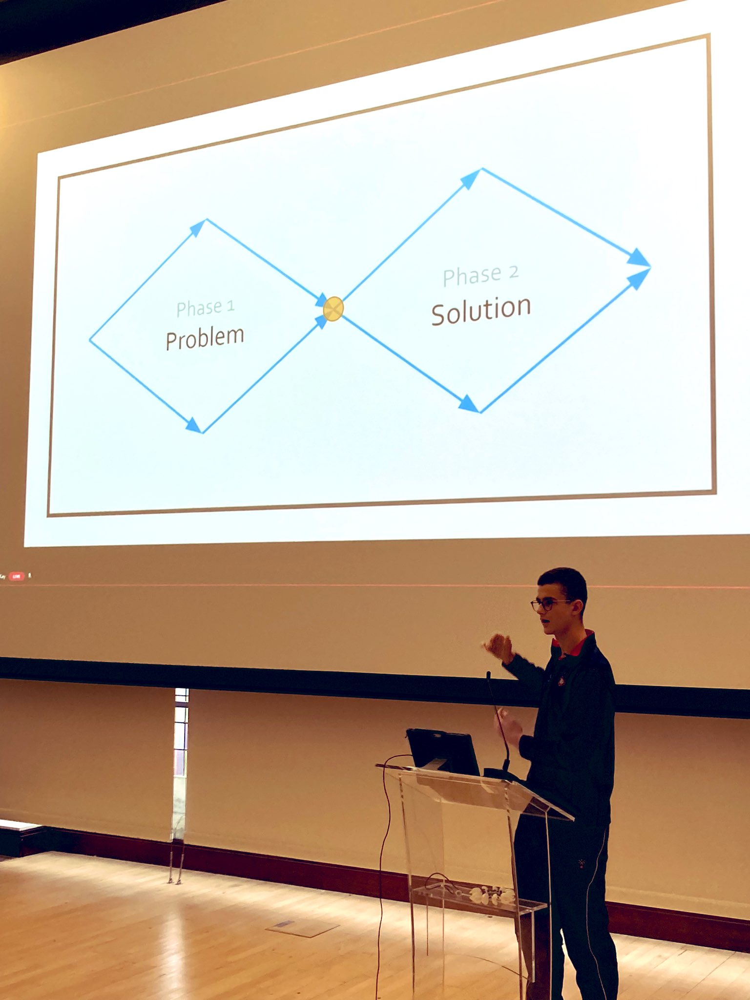
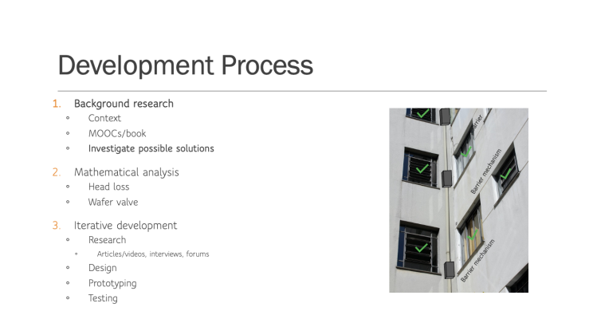
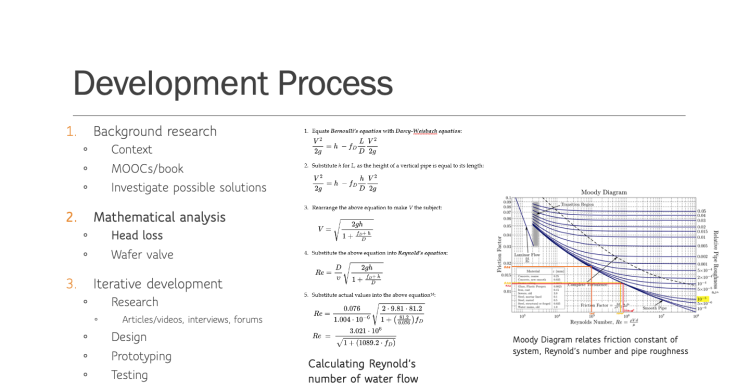
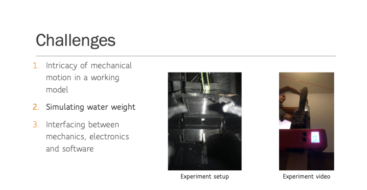

**This project was completed for the Extended Project Qualification (EPQ) and was awarded 100%/A\*.**

<figure>

<figure>

<figcaption>

Soldering the breadboard which controls linear solenoid actuator mechanism

</figcaption>

</figure>

<figure>

<figcaption>

Giving a talk about my project for Tomorrow's Engineers Week

</figcaption>

</figure>

<figure>

<figcaption>

Circuit setup connecting sensors and actuators to Raspberry Pi

</figcaption>

</figure>

</figure>

Over the last 6 months, I have put much time, focus and attention towards this project. And it has been such a rewarding process; I have gone from having virtually no knowledge about electronics to creating a working prototype with sensors, actuators and low-latency communication with a server. I hope you enjoy reading about my project as much as I enjoyed creating it!

Quick heads up: if you'd like to delve straight into the code I wrote for this project, head over to my [GitHub Repo](https://github.com/orlandoalexander/EPQ-Hydroelectric-Generator-for-High-Rise-Buildings).

To read my **report on the project**, keep on scrolling! The report includes research on the problem and existing solutions, mathematical viability analysis for my proposed system, technical details for each aspect of my design and an explanation of the development process behind my design choices.

  

## Project Overview

The **hydroelectric generator for high-rise buildings** provides a novel, concealed energy solution which uses existing infrastructure to generate electricity at a local level. The generator system is contained within a single wastewater pipe running down the side of a high-rise building and is powered by the kinetic energy of the grey water as it passes across a Pelton water turbine located on the ground floor of the building. The system maximizes the energy harnessed from the wastewater by using microcontrollers (Raspberry Pi), electromagnet-operated barriers and integrated liquid and ultrasonic sensors which work together to redistribute the grey wastewater throughout the pipe before it is released across the turbine. 

  
The use of dynamic barriers within the pipe divide the grey water pipe into sections, with each section corresponding to the piping for one floor in the high-rise building. Unlike traditional water tank-based methods of harnessing energy from wastewater which can only capitalise on water leaving the building above the tank, this system means that the wastewater from each floor in the building is stored and then passed over the turbine. Moreover, while water tank-based systems store all the water at a constant head, the wastewater from each floor can be stored at or close to the height at which it is released from the building. This greatly increases the power potential from the wastewater, as a key component of hydropower is the water head.

<figure>

<figure>

<figcaption>

Early prototype of the barrier mechanism

</figcaption>

</figure>

<figure>

<figcaption>

Barrier mechanism (incl. sensors, actuators & Raspberry Pi) prototype

</figcaption>

</figure>

<figure>

<figcaption>

Pelton turbine prototype

</figcaption>

</figure>

</figure>

##   
  
Detailed Project Explanation

  
If you'd like to find out a little more about the system's design and the design process itself, these slides summarise some of the **key ideas** from the report:

- 
    
- 
    
- 
    
- 
    
- 
    
- 
    
- 
    
- 
    
- 
    
- 
    
- 
    
- 
    
- 
    
- 
    
- 
    

  
And finally: **THE REPORT!**

I must warn you, it's quite hefty document at 100 pages strong. So take a deep breath, and dive in:

[EPQ Report](https://orlandoalexander.wordpress.com/wp-content/uploads/2022/04/epq-report-1.pdf)[Download](https://orlandoalexander.wordpress.com/wp-content/uploads/2022/04/epq-report-1.pdf)

  
To see my prototype design for the pipe barrier mechanism of the hydroelectric generator, have a watch of the **short video** below:

\[vimeo https://vimeo.com/696805193\]
